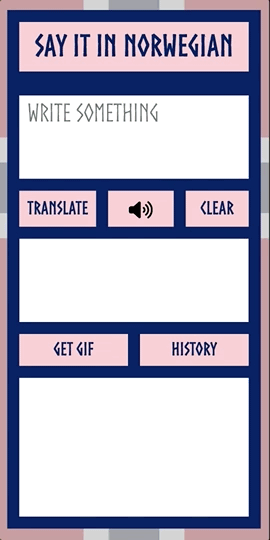

# Say It in Norwegian!
This is the backend of the translation app that takes in English text and translates it to Norwegian, generates a GIF based on the text, with the option of reading the Norwegian translation out loud. It is built with Imba, Node.js, Express, and Firebase Database, and powered by OpenAI, ResponsiveVoice TTS API, and giphy.com API. 

## In This Document:
  
  - [Live Application URL](#live-application-url)
  - [Repositories:](#repositories)
  - [How to Install the App on Your Smart Phone](#how-to-install-the-app-on-your-smart-phone)
  - [How to Use the Application](#how-to-use-the-application)
    - [Home Page](#home-page)
    - [History Page](#history-page)
  - [Technologies Used on the Backend](#technologies-used-on-the-backend)
  - [Future Features](#future-features)
  - [Challenges and Learning Points](#challenges-and-learning-points)

## Live Application URL
[https://sayitinnorwegian.netlify.app/](https://sayitinnorwegian.netlify.app/)

## Repositories:
1. [Client Repository](https://github.com/shantdashjian/say-it-in-norwegian-client).
2. [Server Repository](https://github.com/shantdashjian/say-it-in-norwegian-server).
   
## How to Install the App on Your Smart Phone
This is a [Progressive Web App](https://developer.mozilla.org/en-US/docs/Web/Progressive_web_apps), designed to provide a native app user experience.

## How to Use the Application
### Home Page
1. A traveller to Norway opens the app.
2. The traveller writes the phrase in English.
3. The traveller clicks on Translate.
4. The app should show the translation in Norwegian.
6. The traveller can click on the Speak button and the app should read the translation out loud.
5. The traveller can click on Get GIF and it should display a relevant GIF.
7. The traveller can click on Clear to clear the input area and start over.
   
### History Page
1. The traveller clicks on the History button.
2. The History page should open.
3. There the traveller can see past translations, with the most recent at the top.
4. The traveller could highlight a transation to mark it as "revisit".
5. The traveller could delete a translation from history.
6. The traveller could go back to the Home page.

## Technologies Used on the Backend
1. [Imba](https://imba.io/) for full stack development.
2. [Node.js](https://nodejs.org/en) and [Express](https://expressjs.com/) for the backend.
3. [Firebase Database](https://firebase.google.com/docs/database) for persisting the history of translations.
4. [OpenAI API](https://platform.openai.com/docs/introduction/overview) for generating the translation.

## Future Features
1. The traveller can speak English into the app and the app would capture it in writing and do the translation to Norwegian automatically. 

## Challenges and Learning Points
1. This is the first full stack app I build using Imba.

[Up](README.md)
